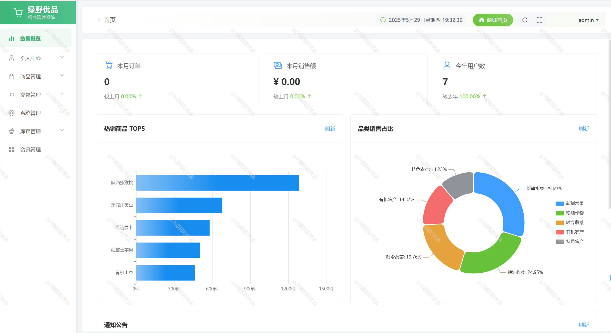

# springbootA374
springbootA374基于协同过滤算法的农产品销售商城LW
 
## 查看主页获取源码

### 一、关键词

基于协同过滤算法的农产品销售商城、个性化推荐商城、蔬菜水果商城、绿色农产品商城、助农推广平台、助农产品商城，农产品销售系统

 

### 二、作品包含

源码+数据库+万字文档+全套环境和工具资源+部署教程

 

### 三、项目技术

前端技术：Html、Css、Js、Vue2、Element-ui 
数据库：MySQL
后端技术：Java、SpringBoot3.0、MyBatis

  
 

### 四、运行环境(以下版本亲测，其他版本未知，请自测)

开发工具：IDEA/eclipse  + vscode

数据库：MySQL8

数据库管理工具：Navicat10以上版本

环境配置软件： JDK17 + Maven3.6.3

前端Nodejs：16

浏览器：谷歌浏览器

### 五、项目介绍

项目编号：springbootA374

本系统是一个基于协同过滤算法的农产品在线销售平台，旨在为农户和消费者提供一个便捷的农产品交易渠道。系统分为前台用户界面和后台管理界面，支持多种角色操作，包含物流跟踪、评价收藏、智能推荐等完整电商功能。

二、角色设计
1. 普通用户
   - 浏览商品
   - 下单购买
   - 查看订单
   - 评价商品
   - 收藏商品
   - 查看推荐商品

2. 农户用户
   - 发布商品
   - 管理商品
   - 查看销售数据
   - 处理订单

3. 管理员
   - 用户管理
   - 商品审核
   - 订单管理
   - 数据统计

三、功能模块设计

1. 前台功能模块
   - 首页展示：轮播图、推荐商品、分类导航
   - 商品模块：商品列表、商品详情、商品搜索
   - 购物车模块：添加商品、修改数量、删除商品
   - 订单模块：下单、支付、查看订单状态、物流跟踪
   - 用户中心：个人信息、收货地址、订单历史、收藏夹
   - 评价模块：商品评价、评价管理
   - 推荐模块：个性化推荐、热门商品

2. 后台功能模块
   - 用户管理：用户信息审核、权限管理
   - 商品管理：商品审核、上下架管理
   - 订单管理：订单处理、发货管理
   - 评价管理：评价审核、评价统计
   - 数据统计：销售数据、用户数据
   - 系统设置：轮播图管理、分类管理

### 六、运行截图

